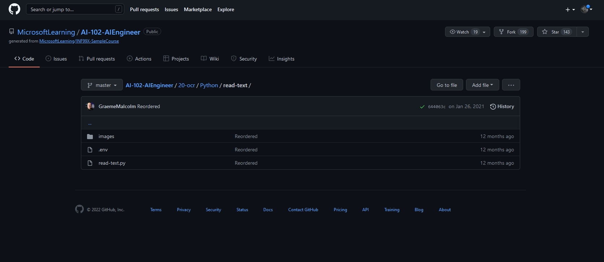
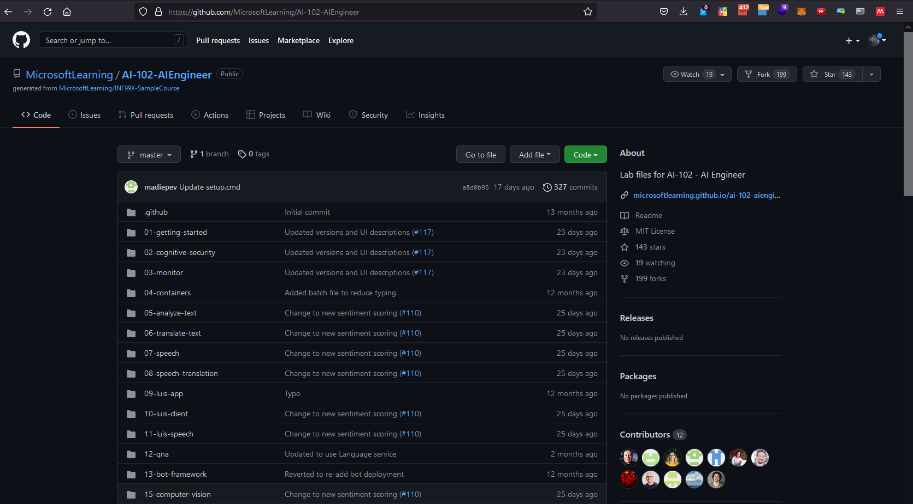

# WHAT IS GIT
Git is a version control system used in software development.
# WHAT IS GITHUB

Github is used to upload your code to back it up. You can also use the public code like you want, just make sure you respect the licence.


This walk through was originally published on my [blog](https://wamaithanyamu.com/how-to-determine-the-packages-used-in-a-python-project)

# HOW TO DETERMINE THE PACKAGES USED IN A PYTHON PROJECT

Have you ever cloned a python project on github that did not include a requirements.txt and you could not make it run on your local machine due to compatibility issues? What if there was a solution that could crawl the whole project and generate a requirements.txt file for you for the packages used and their versions? Well, good news there is!

## Prerequisites
- You need to have python 3.5+ installed - Download python [here](https://www.python.org/downloads/)
- Pip package installer- Download pip from [here](https://pip.pypa.io/en/stable/cli/pip_download/)
- Venv for creating virtual environments - Download Venv from [here](https://docs.python.org/3/library/venv.html)

## Working with projects that do not have a requirements.txt

I came across this issue when I was following machine learning tutorials on Microsft Learn. The github repo only has the code with no requirements.txt. I was particulrly interested in the code for extracting text from images and pdfs. The code looks as shown in the image below.



 You can see there is no requirements.txt. We have to first clone the whole repo then navigate to the specific folder we want to work on



Start by cloning the whole repository.

```shell
git clone https://github.com/MicrosoftLearning/AI-102-AIEngineer.git
```

Then get into the specific folder we are interested in

```shell
cd AI-102-AIEngineer-master\20-ocr\Python\read-text\ 
```
The project structure is as shown below
```
AI-102-AIEngineer-master
└───20-ocr
|      └───Python
|      |    └───read-text
|      |        | read-text.py
|      |        | .env
|      |        └───images
|      |        |   | Lincoln.jpg
|      |        |   | Note.jpg
|      |        |   | Rome.pdf

```

## Setting up an environment

Setting up an environment for a project ensures that the installs done for the project are within that environment without affecting global installs. This can also be useful when a specific package is only installed once on a specific project.
To set up a venv environment:

```shell
python -m venv name-of-environment
```
Name the environment folder what you wish. I'll name mine venv. My current folder structure now looks like
```
AI-102-AIEngineer-master
└───20-ocr
|      └───Python
|      |    └───read-text
|      |        | read-text.py
|      |        | .env
|      |        | venv
|      |        └───images
|      |        |   | Lincoln.jpg
|      |        |   | Note.jpg
|      |        |   | Rome.pdf

```

On windows activate the environment 
```shell
 cd venv\Scripts\ && activate && cd .. && cd ..
```

With the environment set, next we need to install (Pigar)[https://pypi.org/project/pigar/] .Pigar is a tool used to generate a requirements.txt for python projects.
Install Pigar with pip

```shell
pip install pigar
```

To use pigar on our project simply run

```shell
pigar
```
You can find a generated requirements.txt on your project folder. Learn more about pigar from its  [documentation](https://pypi.org/project/pigar/)


With a requirements.txt, install all the dependencies using

```shell
pip install -r requirements.txt
```

Happy hacking! 
